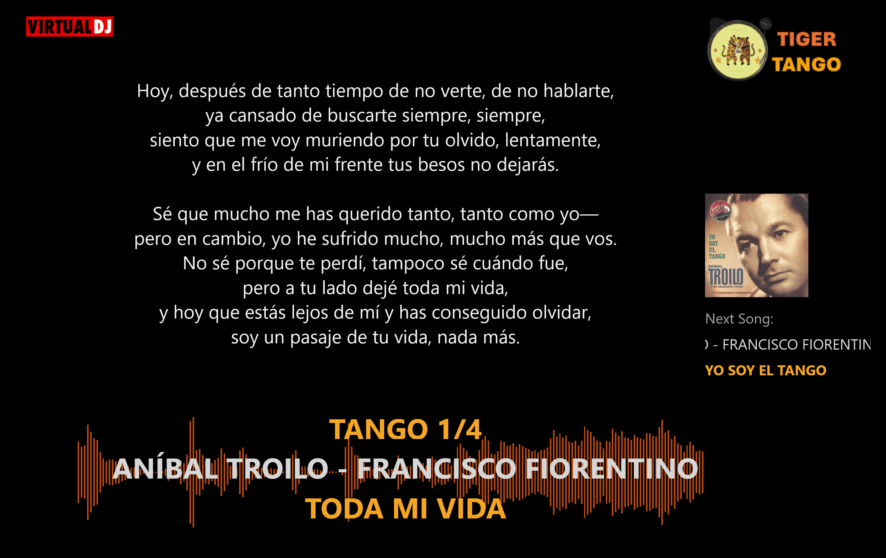
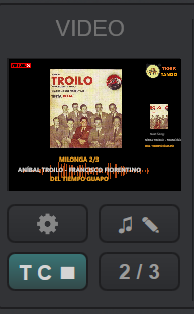
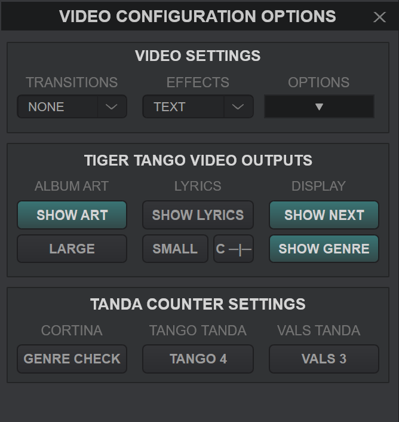

# TigerTango - A VirtualDJ-Based Interface designed for Tango DJs and Other Social Dances

By: Sean Ericson (Sericson0@gmail.com)

A good Tango DJ can enables dancers to find that magical flow and connection we all crave. The art of picking the perfect tandas requires untold hours of study and practice. And nothing kills the magic you are working so hard to create like technical issues. Your DJ software should enable your creativity and not be a hindrance to the flow you are striving so hard to create. This is why I created the TigerTango skin for Virtual DJ. It provides a layout custom suited for the needs of and requirements of tango DJs and other social dances.

This guide discusses how to to get set for DJing tango music with virtual DJ. It walks through the following:
* Installing Virtual DJ (Required for TigerTango)
* Loading the TigerTango Skin (Current recommendation is to use the version on GitHub)
* Installing third party plugins such as EQs
* Description of the layout and use of TigerTango

You can find a video tutorial of TigerTango here https://youtu.be/k9lrT9ofaWw

> [!NOTE]
>  TigerTango is currently in its first version. I have tried my best to make it a tool that will be valuable to Tango DJs and DJs of other social dances, but the only way to know what will be most useful is to have people try it and give feedback. If you run into any issues, or if there were any functionality you wish were updated or added, please reach out to me at sericson0@gmail.com. You can also post an issue on https://github.com/sericson0/TigerTango/issues

 I would love to hear from you!

## Shout Outs and Aknowlegements
This project would not have been possible without the substantial time and expert support from several members of the Tango community.

Huge thank you to **Chris Hart** and **Andrew Hart**. The layout, look, and functionality of TigerTango has been so much improved because of their efforts and support. Of special note, it is because of them that TigerTango is able to display the tanda count, and their work showed the path to be able to integrate lyrics to the video display.

Thank you to **Gabriele Capocelli (DJ Gabbo)** for your work to implement the hot cue buttons, for your expert feedback, and for being the very first user to try out TigerTango!

Thank you to **Michael Plaks** for all of your suggestions, feedback, and support in getting this project to a point where it can be a useful tool to DJs.

Thank you **Eric Heleno** for your great suggestion on making the EQ buttons semiparametric and for giving your expert eye to the skin. And thank you in general for sharing your wealth of knowledge of sound with me. I hear the world differently because of you.

Thank you **Janice Ng** for giving your expert UX developer eye. So many great observations packed into a couple hour session. And thank you for inspring us all with your commitment to your tango growth and art.

Thank you **DJ Ragnar** for your very valuable suggestions. 

Thank you **DJ Claudiu**, **Chris Tran** and everyone who has supported with user testing and providing feedback to this project. And thank you to

Shout out to **Mira Gordin** for designing the tiger logo that I adopted to make the Tiger Tango logo.

Special thank you to **Jacqueline Pham** for your patience and for being willing to answer all my tango DJ questions.

And thank you to you for taking the time to try out this tool and for your part in growing and supporting this community of dancers that we all love.

## Intalling Virtual DJ

To install Virtual DJ, go to https://virtualdj.com/, click on download, choose your system type, and follow the installation instructions.

Virtual DJ is a powerful software used by millions of amateur and professional DJs around the world. Furthermore, it is **free to download and use!**.

The license stipulates that you buy a license (currently $299) if you are using it regularly for paid performances. They have put a lot of time and effort into making a great product, so once you start using it to headline your big festivals and marathons make sure to purchase a license. But in the meantime you can try it out at home and at your local milonga for free.

## Loading the TigerTango Skin

While Virtual DJ is a powerful tool, it is primarily designed for club DJs to mix tracks together. This means there are a lot of buttons and settings that are not useful for tango DJing...unless of course you want to add some cool scratches and beat breaks into that Biagi tanda ;-) There are capabilities that are not in the default Virtual DJ layouts that are very useful for tango DJs.

This is where TigerTango comes in. It provides an interface that has removed what is not needed and added features that are useful for DJing tango.

There are two ways to load TigerTango. You can load version directly from Virtual DJ, or can install the development version from Github https://github.com/sericson0/TigerTango

> [!IMPORTANT]
> Because of the additional safety features added to the development version, we currently recommend you follow the steps for downloading from GitHub.

You can find a list of the changes between the version on VirtualDJ and the version on GitHub in the [ChangeLog](ChangeLog.md)

### Loading TigerTango from VirtualDJ
> [!IMPORTANT]
> We currently recommend downloading TigerTango from GitHub (see steps below) to get the addtional updates and safety features. Once User testing has completed then the version on VirtualDJ will be updated (it takes several weeks to go through their review process).

1. Open VirtualDJ and select settings (the gear icon in the upper right)
2.  Select the Interface tab (looks like a computer monitor)
3.  Select *Get More*
4.  Type *TigerTango* in the search box
5.  Click *Install*
6.  Return to the interface button
7.  Select the TigerTango Skin (should now appear as an option)

You should be all set! (See screen shots for step by step)

### Loading from GitHub

To load the development version:
1. Go to https://github.com/sericson0/TigerTango (If you are reading these instructions online you have already completed this step! You will just need to scroll to the top of the page to clide Code for step 2).
2. Click Code (see image below)
3. Click Download ZIP (see image below)
4. Open the downloaded zipfile (TigerTango-main.zip)
5. Open the zipfile and the TigerTango-main folder (There should be a TigerTango folder inside). I.e., you need the folder labeled TigerTango that has a .xml file and several images inside.
> [!NOTE]
> You can get the path to the virtual DJ skins by going to settings in Virtual DJ, moving to the interface tab, and clicing 'Edit This Skin' in the bottom right. **Go one up from this folder!!! This is where you want to place the TigerTango folder you downloaded.**
6. Move this folder into where VirtualDJ saves skins (See note above). On Windows this is likely C:\Users\<USERNAME>\AppData\Local\VirtualDJ\Skins.

Once you have installed the TigerTango interface, you can open it as follows:
1. Click settings (gear image in upper right).
2. Click **Interface** in left tab (see image below)
3. Select the TigerTango skin (you may have to scroll down)
4. You can now close the settings interface and should have TigerTango loaded!

### OPTIONAL Load the TigerTangoVideo Video Skin.
Some DJs like to Display song information while DJing. However, the default video skin is not ideally suited for displaying what we would want as tango DJs. Therefore we have added the TigerTangoVideo video skin to this repository as well. You can read more about connecting to the Video Skin in the [Video Skin](#video-skin) section.

You can load the TigerTango Video skin using the following steps.
1. Follow the steps in Loading from GitHub (section above) to download and unzip the TigerTango-main.zip file.
> [!NOTE]
> You can get the path to the virtual DJ video skins by going to settings in Virtual DJ, moving to the interface tab (on left), change to Video Overlay tab (on top) and clicing 'Edit This Skin' in the bottom right. **Go one up from this folder!!! This is where you want to place the TigerTangoVideo folder you downloaded.**
2. You need to move the **TigerTangoVideo** folder to where Virtual DJ saves video skins. In Windows this is C:\Users\<USERNAME>\AppData\Local\VirtualDJ\VideoSkins

3. Open Settings -> Interface (tab on left side) -> Video Overlay (tab on right side) -> Select *TigerTangoVideo (edit)*
4. You can now close settings.

When you display video it should now use the TigerTangoVideo interface.

## Initializing Changes Made by TigerTango and Recommended Settings
TigerTango makes a number of changes to settings when opened. This helps reduce the chance for errors and improves functionality.
>[!IMPORTANT]
>TigerTango has implemented several safety checks in the area labeled TOOLBOX. If you see one of the warning lights come on, it means a setting is incorrect. Clicking a warning light will update this setting to the one recommended by TigerTango

TigerTango has implemented 2 Cue buttons to help with staring Cortinas or songs from points other than the beginning. TigerTango has also implemented a LOOP button which adds a loop between the two cue positions. We recommend you change the setting **autoSortCue**, which orders cue positions chornologically. This will ensure the loop button works as intended.

If you are DJing for a show and want to turn background notifications off then consider setting **exclusiveAudioAcess**

## Installing Plugins

Tango DJs and Club DJs are opposites: *Club DJs play high quality recordings of low quality music while tango DJs play low quality recordings of high quality music* ;-) Jokes aside, what club DJs do is mix and modify parts of songs to enhance the energy and flow in the room, whereas when tango DJs modify a song it is primarily to remove artifacts such as hiss or add lost frequencies such as bass frequencies to bring out to enhance the sound quality of the recording. This is why different tools are required.

Enhancing the sound quality of older recordings can be done with EQing. While there is a 3-band EQ built into the TigerTango skin, more advanced EQ plugins can be installed.

Here I show how to install *TDR NOVA*, a powerful and free parametric EQ by Tokyo Dawn Records.

1) Go to https://www.tokyodawn.net/tdr-nova/ and select the correct installer for your computer
2) Run the installer on your computer
3) Accept the license agreement and click through next on each popup.
4) Open Virtual DJ options, search **vstFxFolder**, and set to where your VST3 files save to. On Windows this is "C:\Program Files\Common Files\VST3"
5) Close and restart Virtual DJ

* Tokyo Dawn has some additional nice free and paid plugins.
* https://analogobsession.com/ hvas a number of free analog emulations that are worth checking out
* Voxengo has a free 16 band graphic equalizer https://www.voxengo.com/product/marvelgeq/
* Toneboosters has a free audio spectrogram for those interested in visualizing the music https://www.toneboosters.com/tb_spectrogram_v1.html

* You can also connect any VST3 plugin into Virtual DJ.

## Using TigerTango

This section decribes how to set up your workflow for Tango DJing. The Virtual DJ user manual here https://virtualdj.com/files/VirtualDJ_User_Manual.pdf has additional useful information.

### Configuring Audio
For Virtual DJ to work correctly, you need to configure your audio to play how you want it.

1. Click on settings
2. Select the Audio tab (looks like a speaker)
3. Select Speaker only or Speaker + Headphones. Setting speaker + headphones gives you the ability to use headphones for prelistening.

1. Select where you want your speakers and headphones to play from.
   1. When in doubt, select chanel 1 & 2 for your *master* out.
   2. If you want to send your sound through an interface such as an Apollo, where you apply additional plugins, then you might select Virtual 1 and 2.
   3. Make sure to send headphones to a different output than the master speakers.
2. Select Apply to accept the configured changes.

### Layout

(Note that this documentation gives the github layout. The version on the Virtual DJ website has some differences.)

TangoTiger is separated into 7 main components.
1. **Browser** Set up playlists and can search for songs in your library.
2. **Staging Area** Prepare your tandas.
   Note: The staging area is an always viewable automix panel, which allows you to use the side view in the File explorer panel to pull up playlists. This is one of the additions of TigerTango to help with tango DJing.
3. **Decks 1 and 2** Where songs will play from. TigerTango is set up to play in dualdeck mode.
4. **Master** Includes master effects (plugins) and your master fader. Also includes information on headphone volume and mic volume when these are plugged in.
5. **Info** Access settings and information such as time, master VU metering, and battery life.
6. **Toolbox** Includes additional plugin spaces and warninig indicators that denote settings that could cause issues with TigerTango.
7. **Panels** Opens movable resiable windows.

#### Browser
You can find detailed documentation on the browser section in the virtual DJ user manual [here](https://virtualdj.com/manuals/virtualdj/interface/browser.html) (https://virtualdj.com/manuals/virtualdj/interface/browser.html)

Main notes are:
* You can access your music files in the left panel
* You can Build subfolders and playlists to organize your music
* You can search for songs in the File list panel (second from the left)
* You can add folder shortcuts and build playlists in the sideview planel (middle right)
* You can access and update song information, including editing and adding tags and metadata, in the File Info panel on the right.

> [!WARNING]
> When making playlist files in virtual DJ, you will want to right click and select 'Keep Order'. This will ensure that the playlist order will not be accitentally changed.

### Staging Area
The staging area is an always-available automix panel. Here you can build your tandas and cortinas.

You can read more about how automix works [here](https://virtualdj.com/manuals/virtualdj/interface/browser/sideview/automix.html)

You can also read about importing playlists into Virtual DJ, such as from ITunes or traktor [here](https://virtualdj.com/manuals/virtualdj/interface/database/playlists/index.html).

> [!NOTE]
> When Automix is on, a blue line will show on the currently playing song (sometimes takes 1 song for it to show up). This gives an indicator of where you are in your playlist.

### Decks

TigerTango uses two decks so you can prepare the next **track** while one is playing. Each deck has the same sections, with the following properties:

1. **Track Info** Gives information including:
   * track name and artist name
   * Beats per minute (not always accurate on tango songs)
   * Key
   * Time elapsed / timeremaining in song.
   * Song waveform.

   You can skip ahead or back by moving the line on the waveform.
2. **Effects** You can add effects plugins such as EQing to a deck here. Plugin sections work as following:
   1. Click the chevron to open a dropdown which allows you to select the effect.
   2. Clicking on the plus button opens up the effect graphical interface.
   3. Click the effect button not on the dropdown chevron (where the effects name is located) to toggle the effect. The effect button will light up when active.
3. **Dropzone** Add a track to the deck by dragging and dropping it here. The turntable will spin when a deck is playing. TangoTiger should automatically change settings to turn off scratching, but this is something you may want to test before playing to the public :-)
4. **EQ and Pitch** You can adjust the Low, Mid, and High of a track along with adjusting the playback pitch by moving the sliders here. THe sliders provides a bell curve eq. TigerTango defaults to the following frequency bands:
   *  Low at 150 Hz - for changing bass frequencies
   *  Mid at 1 kHz - for changing song "presence"
   *  High at 8.5 kHz - for reducing song hiss.

Move the slider up to boost a frequency, and move the slider down to cut the frequency
> [!NOTE]
> The three band equalizers are for quick adjustments. Installing a parametric eq plugin will give greater control over removing hiss and adjusting sound.

Some tango music has been transferred at an incorrect pitch. If you happen to notice that a track is incorrect durnig prelistening, you can adjust the pitch using the pitch slider. Sliding up with REDUCE the pitch and sliding down witll INCREASE the pitch. The pitch slider is given as a failsafe for bad transfers. The much better approach is to DJ using high quality transfers which have the correct pitch to start with

5. **Volume Slider**. Slider can be used to adjust or balance deck volume.

> [!NOTE]
> TigerTango adjusts the deck volume when fading or prelistening. After prefading or pre-listing the deck volume is reset to 100%. It is recommended to primarily adjust sound volume through the master fader and only use deck faders to ocassionally balance volume between songs.

> [!IMPORTANT]
> If a deck is playing but no sound is coming out, it may be because the deck volumne is down.

6. **Pre-listen**. The pre-listen button allows you to listen to a song ahead of time in headphones. It implements the following logic:
   * When turned on it first checks to make sure the deck is not playing to the main speakers. Then it turns the volume of the deck off, sets to play through headphones, and starts the track.
   * When durned on it resets volume to 100% and resets track to starting.

> [!IMPORTANT]
> If you want the deck volume other than full, or start the song at a point other than the beginning, then remenmber to change to the desired setting after toggling off pre-listen.
7. **Controls** TigerTango has implemented four playback controls:
   1. **Play/Pause** Starts or stops the current track.
   2. **Fade** Fades out current track. At end of fade it resets the deck volume to 100%.
   3. **ADD** If you select a set of tracks and click this button, it will add them to the bottom of the automix list.
   4. **AUTO** Toggles on or off automix. The automix will start with whichever deck you select auto on.
   5. **AutoFade** Fades out deck, starts song on other deck, and loads next song in playlist onto current deck. If you have a cortina that you want to fade out and then start the next tanda, you can do this with AutoFade.
   6. TigerTango has implemented two hot cues. These can be used to start cortinas part of the way through the song.
   * Click on a hot cue to set it wherever the song position is.
   * Click it again to start song from hotcue position.
   * Right click to remove hotkey.
   1. TigerTango has implemented a LOOP button. When both hot cues are added, then clicking LOOP will add a loop between these two positions. Once the song enters the loop it will repeat until you click or right click the loop button.

### Master

The Master section Has four components:
1. **Master Effects** There are 5 effects slots where you can add plugins such as compressors, limiters, saturation, or EQ. (The toolbox has 2 additional plugin spots). Virtual DJ can integrate with any VST-based plugin. You can add VST plugins by placing them in the Virtual DJ vstFxFolder path (search vstFxFolder in the Virtual DJ options).

To use a plugin, follow these steps:
   * Click the dropdown chevron to select the effect
   * Press the plus to toggle the effect's graphic interface
   * Click the effects button to toggle on or off the effect (when on the effect button will change color)
2. **Master Video** Here you can add video effects such as projecting the song album art or title to an external monitor. See the [Video Skin](#video-skin) section later in this document for more details.
3. **Master Volume** This fader changes the sound going to the speakers.
4. **Headphone Volume** When audio is set up for both speakers and headphones, then you can change the headphone volume here. The Mix slider determines what percent of the main mix comes through headphones. If you want to just head the headphone song, then turn mix volume to zero.
5. **Mic Volume** If you have a mic connected to your interface, then you can selet the mic volume here.

### Info Section
The Info section presents the following:

1. A VU meter for the master fader along with a clipping indicator.

> [!IMPORTANT]
> **IF THE CLIPPING INDICATOR IS LIGHTING UP, TURN DOWN THE MASTER FADER!!!**
2. A CPU usage indicator. **If the CPU is high, then make sure to turn off other programs or reduce the number of plugins used**
3. Battery level if the computer is not plugged into a power source. **If you see a battery symbol, this means your computer is not plugged in**
4. Current time
5. Settings menu (gear icon). Click to open the Virtual DJ settings option.
6. A button to toggle between Stero and Mono outputs. Defaults to Stereo. If Mono is activated, then left and right channels are summed before sending out to main.

### Toolbox
The Toolbox section contains an array of tools and checks.

* One additional plugin areas (Comes after the end of the 5 main plugins).
* Record button which opens the recording editor. This can be useful for creating snippets of songs or for quickly recording silence to pad songs or to be used as dummy markers for tanda breaks.
* Button to toggle between single deck and dual deck automix. Displays **S** in single deck and **D** for dual deck.
*
The toolbox also includes several warning icons. Some Virtual DJ settings can cause TigerTango to not work as expected. If a warning icon lights up this means that a setting is not as recommended. Click on a lighted warning light to change the setting to what is recommended for TigerTango. The following warnings are implemented:

* Warning if soundcard is throwing error. Click to open audio settings
* Check if Automix double click is set to nothing. Click to change to suggested setting, right click to supress warning
* Double deck automix check. (Automix button only works with double deck) Click to change to double deck. Right click to supress warning.
* Automix setting check. Some automix options will fade songs before their completion. Click to set to back-to-back. Right click to set to skip silence at start and end of songs.
* Automix tempo check. Incorrect setting could cause tempo changes when switching between songs.
* Automix fade length check. Setting the automix fade length as a positive number will clip the end of the song when using some automix types. Setting to negative number will give a gap between songs (ideal for tango). Click to set to -3 (3 second gap). Right click to set to 0.
* Crossfader check. TigerTango is designed to work with the crossfader disabled. If enabled can cause songs to not play.
* Fader Start check. If fader start is on, then will cause issues with fade and auto fade buttons. Click to disable
* Auto settings check. Checks that Auto match key, pitch, and tempo are turned off.

### Panels
Click on a panel to open an adjustable panel window. The following panels are options
* **BROWSER** Opens a movable and expandable browser panel. Most useful for prework if you want to use multiple monitors.
* **SEARCH** Opens an expandable search panel. Best suited for prework
* **SIDEVIEW** Opens an expandable sideview panel
* **WAVEFORM** Opens an expandable window to show the song waveform.
* **SIDELIST** Opens an expandable sidelist panel. Can be useful if you have preset possible tandas that you would like to pull from
* **INFO** Opens and expandable info panel. Useful for metadata work.
> [!IMPORANT]
> The GitHub version has replaced the panels on the left with a toolbox area. This has two additiona plugin spaces (come after the top plugins in order) and includes the setting warning indicators. In the top left is also a small record button which can be used to record short blank tracks to add silence or use as dummy spacers to separate tandas.

Note: In the GitHub version, the STAGE panel has been replaced with a waveform viewer window.

## Video Skin

The TigerTango Video skin allows you to display

* Track title and artist
* Genre and position in the tanda
* Upcoming Track
* Album cover art
* Song lyrics

> [!IMPORANT]
> For full functionality, you need to download both the TigerTango skin and the TigerTangoVideo Video skin (they are two separate things). See installation notes above for installation details.

> [!NOTE]
> If the TigerTangoVideo video skin is not loaded, then a popup button at the bottom of the configuration menu will apprear.

The Video area in the Master section controls video outputs.

### Video Area
The Video area is where you will click to display the video screen. There will be a video that you can pull to an external display or monitor along with a preview on the TigerTango skin
* Click the video symbol to toggle display
* Right click to toggle the type of output
* If the video is active, then right click the video display area to toggle between a small and large preview. Large preview can be easier to see what is being displayed.

### Options

The Options button opens the video configuration options window

#### **Video Settings**
This area allows you to update video effects, transitions, and options. See the virtual DJ documentation for a complete description of these  options
#### **Tiger Tango Video Outputs**
These buttons control elements on the TigerTango video screen.
* **Show ART** toggles whether or not to display album art.
* **Album Art Size** toggles between displaying a large or smaller album art on the display.
* **Show Lyrics** toggles whether to display lyrics. Lyrics can be saved in the *Comments* metadata section (see more about showing lyrics below).
* **Lyrics Size** cycles between smaller, medium, and larger lyrics text fonts.
* **Lyrics Justification** toggle between left justification and center justification
* **SHOW NEXT** toggle whether to display a panel of what the next track will be.
* **Show GENRE** toggle whether to display the track genre above the artist name.
#### Tanda Counter Settings
These buttons configure how the tanda counter operates. See [Operating the Tanda Counter](#operating-the-tanda-counter-the) for a description of how to operate the tanda counter. The tanda counter displays which position in the tanda the current track is in, such as being the 3rd of 4 songs.

The counter will loop to 1 whenever the track number is above the current tanda number. It will also reset when a cortina is detected.
* **GENRE CHECK** By default, a cortina is identified as any song whose genre is not in: Tango, Vals, Milonga, Alternative (case does not matter). If Genre Check is activated, then a cortina will be idenfied when 'Cortina' is included in the genre name.
* By default, Tango tandas are 4 songs and Vals tandas are 3 songs. These can be updated to 3 (4) songs by toggling the buttons. Milongas and Alternative songs are fixed at 3 songs for the tanda.

### Lyrics
Click the lyrics button to toggle displaying lyrics on or off. Right click to edit the lyrics of the currently loaded song.
Note that lyrics are added to the comment section of a track.

### Operating the Tanda Counter
The tanda counter allows you to display the tanda position on screen. Click the **TC** (Tanda Counter) button below the options button to start the counter. The suggested process is to start the counter before the first song in your set. See the above section for setting options.

> [!IMPORTANT]
> The tanda counter identifies tanda length by looking at the **Genre** metadata tag. Identified generas are ones which contain the words Tango, Vals, Milonga, Alternative (case does not matter, and can contain other words).

The button to the right of the **TC** button shows the current tanda position. Clicking it will increment the position, Right click to reset to zero. Each time a new song is loaded the counter should increment by 1.

## Displaying Lyrics
You can display lyrics to the screen as follows:
1. Add lyrics to the **Comments** metadata tag (unfortunately the comments tag was the only option to use because it is the only tag that allows multiline inputs).
> [!NOTE]
> You can add lyrics by selecting a song and clicking the 'COMMENTS' section in the info browser area (bottom right area).
> You can also edit the lyrics of a currently loaded song by right clicking on the lyrics button in the video area.
2. Open the Video Options panel and enable **SHOW LYRICS**
3. Start the video. Lyrics should display after 12 seconds of showing the album art.
4. You can change text size through the options panel.
5. Tracks without lyrics (empty comment tag) will display the album art by default.

You can also include translations by including them in the comments as well (Any text in the comments tag will display as static text).

> [!WARNING]
> Enabling lyrics will display any comments in your track comments metadatdata area

The lyrics text can have 13 rows, 16 rows for medium text, and 18 rows for large text (numbers may vary by a row or two depending on skin streatching). For some songs, this means that you will have to combine multiple short rows of lyrics onto a single row.

While there is no automatic way to project both lyrics and translations, you can add translations by including them as a second column. For example:

letra fila uno    lyrics line one
fila dos ...      line two ...
fila tres ...     line three .....

> [!NOTE]
> If you are adding both lyrics and translations, it will likely display best if you toggle the left justification in the video options menue so that the lines to keep the columns aligned.

## Troubleshooting
Here are a few common issues along with troubleshooting steps

### No Audio is coming out?
1. If the deck wont move when you press play, then it is very lidekly that the audio is not configured correctly. Go into Settings -> Audio. Make sure that there are no errors by the master output. Try changing the channels to 1 & 2.
2. Look at the VU meter next to the master fader (in MASTER VOL area). If it is not moving then it likely means one or more of the following:
   1. Deck is not playing (check that the turntable is moving)
   2. deck volume is off (check deck volume slider)
   3. Master fader is off (check master fader in MASTER VOL area)
3. If the VU meter is moving but no sound is coming out, then it is likely one the following.
   1. Your computer is muted or at low volume. Check your computer volume. Suggested volume for good gain staging is somewhere around 80%.
   2. Something downstream of your computer is not turned on and configured properly. Check that your DAC, Mixer, and speaker are all turned on and plugged in.

### Headphone Prelisting is not working?
1. First check your audio settings that your system is configured to both main and headphones.
2. Check that the headphone output is properly routed to your headphones.
3. Next check that the PFL (prefade listen) is turned on for the deck you are listening to. This is the light below the headphones icon. If it is not turned on then press the button. Clicking the preklisten button (headphone icon) should also automatically turn on PFL.
4. Check that your headphones are plugged in.

### Using Automix
When using automix, there are two main recommendations to avoid issues.
1. **Don't reach the end of your automix.** Automix tends to work best when it knows what song is coming next.
2. **Add tracks to the playlist, not directly to the deck.** Automix may not always no where to play next if it plays a track from the deck which is not added to the automix. This can lead to unexpected behavior. It is recommended to add songs to the playlist and let automix load them to the deck.

### Skin Flickering
If you happen to notice the skin flickering then you will want to change the following setting
* Settings -> Options -> experimentalSkinEngine -> Off
The **experiementalSkinEngine** setting can reduce computer CPU usage but can coause flickering on some computers.

## Example Workflow
This section walks through how you could use TigerTango for DJing.

### Prework
* You can create subfolders, such as most liked songs by artist, period, and singer in the browser panel
* You can attach shortcuts to folders and playlists which can be seen in the side view. For example, you could have shortcuts to cortinas, vals tandas, milonga tandas, modern orchestras, and alternative tandas
* You can use the sidelist to start planning tandas and potential flow.
* Create dummy tanda breaks or silence inserts using the record button.

> [!NOTE]
> Setting **Automix Type** to "None (back-to-back)" will leave however much song silence is at the beginning and end of each song. Setting to "Fade (remove silence)" will add a gap of have whatever the negative of the setting 'automixFadeLength' is set to. Recommend using -3 seconds to add a  3 second gap.

#### During the night
* Drag your first tandas into the staging area and click AUTO to begin playing. This will loop through the playlist one song at a time.

* Use the **Prelisten** button on the non-active deck to listen to the up upcoming song. ()
* Use the deck effect and master effects areas. to do any needed EQing or addition of other effects.
* You can preset effects and then toggle them on or off as needed.
* The **AUTO FADE** button can be used to fade out a cortina and allow the automix to continue as desired.
* For performances, Turn off the Automix and load one deck at a time into the player. This will ensure that the next sond does not start playing before the performers are ready.
*  Once performances are over you can restart **AUTO** to continue the night.

> [!WARNING]
>  The automix can be finicky at times in VirtualDJ. Check the song on the other deck to make sure the song you want to play next is lined up

> [!Note]
> CHECK When adding the next song in automix, it tends to work best to add to the next in line in the staging area instead of directly to the deck.

## Providing Feedback
Please consider this version of TigerTango as an initial stable release. I have tried my best to make it a tool that is useful and valuable to Tango DJs and other social dances, but I am sure there are additional steps to make it more useful and robust.

If you run into any issues, or have any thoughts, suggestions, or requests for improvements, I would love to hear from you. I would also love to hear if you find this tool useful.

> [!NOTE]
>  You can reach me at sericson0@gmail.com or can post on github at https://github.com/sericson0/TigerTango