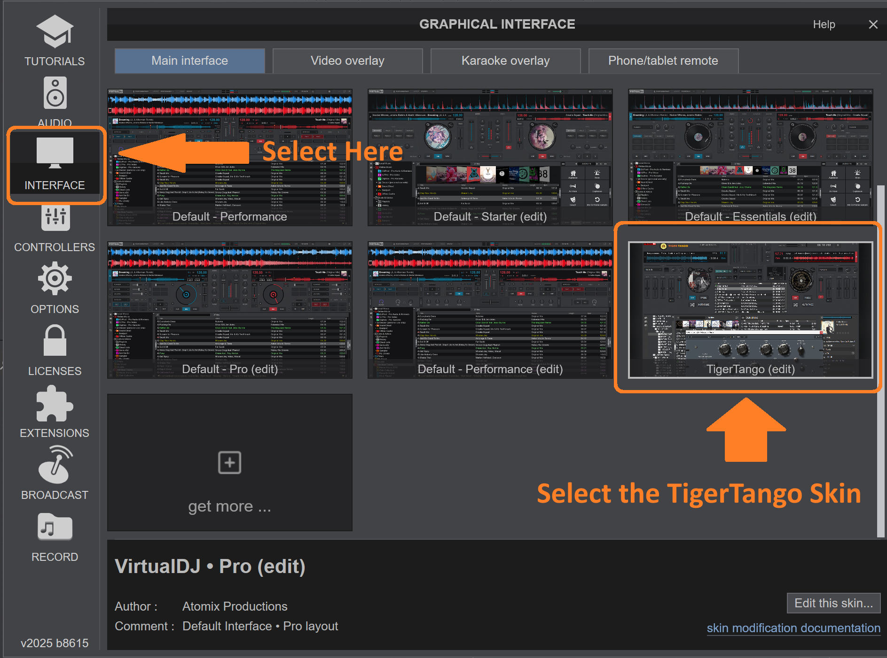

# Intalling Virtual DJ

To install Virtual DJ, go to https://virtualdj.com/, click on download, choose your system type, and follow the installation instructions.

Virtual DJ is a powerful software used by millions of amateur and professional DJs around the world. Furthermore, it is **free to download and use!**.

The license stipulates that you buy a license (currently $299) if you are using it regularly for paid performances. They have put a lot of time and effort into making a great product, so once you start using it to headline your big festivals and marathons make sure to purchase a license. But in the meantime you can try it out at home and at your local milonga for free.

## Loading the TigerTango Skin

While Virtual DJ is a powerful tool, it is primarily designed for club DJs to mix tracks together. This means there are a lot of buttons and settings that are not useful for tango DJing...unless of course you want to add some cool scratches and beat breaks into that Biagi tanda ;-) There are capabilities that are not in the default Virtual DJ layouts that are very useful for tango DJs.

This is where TigerTango comes in. It provides an interface that has removed what is not needed and added features that are useful for DJing tango.

The simplest way to download TigerTango is directly from Virtual DJ. If you want the latest version with any new features, you can also install the version from Github https://github.com/sericson0/TigerTango

### Loading TigerTango from VirtualDJ

1. Open VirtualDJ and select settings (the gear icon in the upper right)
2.  Select the Interface tab (looks like a computer monitor)
3.  Select *Get More*
4.  Type *TigerTango* in the search box
5.  Click *Install*
6.  Return to the interface button
7.  Select the TigerTango Skin (should now appear as an option)

You should be all set! (See screen shots for step by step)

### Loading from GitHub

To load the development version:
1. Go to https://github.com/sericson0/TigerTango (If you are reading these instructions online you have already completed this step! You will just need to scroll to the top of the page to clide Code for step 2).
2. Click Code (see image below)
3. Click Download ZIP (see image below)
4. Open the downloaded zipfile (TigerTango-main.zip)
5. Open the zipfile and the TigerTango-main folder (There should be a TigerTango folder inside). I.e., you need the folder labeled TigerTango that has a .xml file and several images inside.
> [!NOTE]
> You can get the path to the virtual DJ skins by going to settings in Virtual DJ, moving to the interface tab, and clicing 'Edit This Skin' in the bottom right. **Go one up from this folder!!! This is where you want to place the TigerTango folder you downloaded.**
6. Move this folder into where VirtualDJ saves skins (See note above). On Windows this is likely C:\Users\<USERNAME>\AppData\Local\VirtualDJ\Skins.

Once you have installed the TigerTango interface, you can open it as follows:
1. Click settings (gear image in upper right).
2. Click **Interface** in left tab (see image below)
3. Select the TigerTango skin (you may have to scroll down)
4. You can now close the settings interface and should have TigerTango loaded!

### OPTIONAL Load the TigerTangoVideo Video Skin.
Some DJs like to Display song information while DJing. However, the default video skin is not ideally suited for displaying what we would want as tango DJs. Therefore we have added the TigerTangoVideo video skin to this repository as well. You can read more about connecting to the Video Skin in the [Video Skin](#video-skin) section.

You can load the TigerTango Video skin using the following steps.
1. Follow the steps in Loading from GitHub (section above) to download and unzip the TigerTango-main.zip file.
> [!NOTE]
> You can get the path to the virtual DJ video skins by going to settings in Virtual DJ, moving to the interface tab (on left), change to Video Overlay tab (on top) and clicing 'Edit This Skin' in the bottom right. **Go one up from this folder!!! This is where you want to place the TigerTangoVideo folder you downloaded.**
2. You need to move the **TigerTangoVideo** folder to where Virtual DJ saves video skins. In Windows this is C:\Users\<USERNAME>\AppData\Local\VirtualDJ\VideoSkins

3. Open Settings -> Interface (tab on left side) -> Video Overlay (tab on right side) -> Select *TigerTangoVideo (edit)*
4. You can now close settings.

When you display video it should now use the TigerTangoVideo interface.