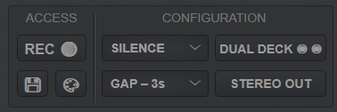

# Layout and Use of TigerTango

This section walks through the various aspects of the TigerTango skin. Because TigerTango is built on Virtual DJ, you will also want to look through the Virtual DJ user manual here https://virtualdj.com/files/VirtualDJ_User_Manual.pdf for additional useful information.

## Overview of Layout

TangoTiger is separated into 6 main components.
1. [Browser](#browser) browser Set up lists and search songs.
2. [Staging Area](#staging-area) Prepare playlist (stage tandas).
3. [Decks](#decks) Play songs, EQ, Fade songs, and prelisten.
4. [Master](#master) Add master effects (plugins), connect to video skin, master fader, and headphone and mic volume.
5. [Shortcuts](#shortcuts) Shortcuts to useful settings such as automix and color settings. 
6. [Info](#info-section) settings and status information such as time, master VU metering, and battery life, and warnings panel.

The following sections go over each in detail.
## Browser
TigerTango usese the default browser layout from VirtualDJ. Detailed documentation on the browser section in the virtual DJ user manual [here](https://virtualdj.com/manuals/virtualdj/interface/browser.html) (https://virtualdj.com/manuals/virtualdj/interface/browser.html)

### Folder List
Allows you to connect to music folders and build playlists. The far left bar allows you to set folder shortcuts. 

> [!IMPORTANT]
> Virtual DJ can connect in with Itunes, Recordbox, and Traktor folders, so you do not need to rebuild your folder structure if you are transferring over from these platforms

You can also read about importing playlists into Virtual DJ, such as from ITunes or traktor [here](https://virtualdj.com/manuals/virtualdj/interface/database/playlists/index.html).

> [!Note]
> If you change metatags using an external editor, you will want to reload the tags in Virtual DJs database:
> * right click on the folder with updated tags
> * select **Batch** 
> * select **Reload tags**

> [!WARNING]
> When making playlist files in virtual DJ, **right click and select 'Keep Order'**. This will ensure that the playlist order will not be accitentally changed.

### File List
The File List allows you to search for tracks. Right click on the column names to add or remove columns. 

> [!NOTE]
> Click the small circle to the right of the search bar to change search settings.  

### Sideview
The sideview panel allows you to toggle between the Sidelist (useful for prepping potential tandas), the Automix panel, and shortcut lists. You can add a shortcut by dragging a list from the Folder List area to the sideview area. 
> [!NOTE]
> The staging area is an always viewable automix panel, which allows you to use the side view to pull up playlists. This is one of the useful additions of TigerTango to help with tango DJing.

* You can add folder shortcuts and build playlists in the sideview planel (middle right)
* You can access and update song information, including editing and adding tags and metadata, in the File Info panel on the right.
  
If you go to the automix panel in side view and select the small circle in the upper right, then you will access a menu where you can change automix settings and clear the automix.

### File Info
The file info area allows you to see and edit track information. The file info area also allows you to prelisten to tracks. Click the play button at the top to prelisten. Click on the small button next to the prelisten area to access the tag editor. 

## Staging Area
  
The staging area is an always-available automix panel. Here you can build your tandas and cortinas.

You can read more about how automix works [here](https://virtualdj.com/manuals/virtualdj/interface/browser/sideview/automix.html)

> [!NOTE]
> When Automix is on, a blue line will show on the currently playing song. This gives an indicator of where you are in your playlist.

> [!IMPORTANT]
> When you have automix turned on, then you will want to load songs into the staging area instead of directly onto decks. While TigerTango allows both single and dual deck automix, **we recommend you use dual deck automix so that you can always see what song will play next**.

> [!WARNING]
> When starting or restarting automix, Virtual DJ will use the first instance of the to determine list position. If you have multiple instances of the same track (such as reusing the same cortina), then double check that automix is playing from where you want it.  
## Decks
TigerTango has two mirrored decks. Two decks allows you several options that would not be available on a single deck. 
* For performance, you can cue the upcoming song on the inactive deck so that it is ready when needed. 
* In singled deck automix mode, you can use the inactive deck to prelisten. 
* In dual deck automix mode you can prelisten and EQ the upcoming song along with having a check on what the next song will be.  

The figure below breaks down the deck areas of [Track Info](#track-info), [Drop Zone](#drop-zone), [Volume](#volume), [Pre-listening](#pre-listen), [EQ and Pitch](#eq-and-pitch), and [Spectrum Analyzer](#spectrum-analyzer)

### Track Info

The track info area gives information including:
   * track name and artist name
   * Beats per minute (not always accurate on tango songs)
   * Song key (click to change between harmonic and numeric)
   * Time elapsed / time remaining in song. (click to toggle between time elapsed and time remaining)
   * Song waveform.
The white line displayes the current song position. You can change position by dragging the line. If you add cue points or a loop to the song, they will show up on the waveform.  

### Drop Zone 

Add a track to the deck by dragging and dropping it here. The turntable will spin when a deck is playing. 

> [!NOTE]
> When in automix mode, the dropzone will deactivate decks used for mixing (both in dual deck, active in single deck). This will be signified by a ⊘ symbol showing up. This is a safety to help automix work as intended. You can deactivate this safety by right clicking the "Single Deck / Dual Deck" button in the shortcuts area.  

### Controls

#### First Row 
First row of controls are ADD, PLAY, and AUTO.
* **ADD** will add selected songs to the bottom of the staging area. This is useful for adding tandas.
* **Play/Pause** Starts or stops the current track.
* **AUTO** Toggles on or off automix. 
>[!WARNING]
> If no song is playing, then clicking automix will start playing from whichever deck you select auto on! **DO NOT CLICK AUTO IF YOU ARE NOT READY TO PLAY MUSIC**

#### Second Row
The second row of controls are the FADE, AUTO FADE, and FADE DURATION. 
* **FADE** fades out current track and does not play the next song. At end of fade, it resets the deck volume to 100%. FADE can be useful for fading out the cortina before a performance. FADE uses the fade length set by the FADE DURATION button.
* **AUTO FADE** fades out the current track and then continues with the next track in the playlist. AUTO FADE uses the fade length set by the FADE DURATION button and used a fixed 2 seconds of silence before the next song. AUTO FADE can be useful for fading out a cortina
* **FADE DURATION** Set the fade duration for FADE and AUTO FADE. Options are 3, 5, 7, or 9 seconds. 
 
#### Third Row
The third row are advanced buttons for setting hot cues and a loop. 

The first two buttons are hot cues. These can be used to start cortinas part of the way through the song.
* Click on a hot cue to set it wherever the song position is.
* Click it again to start song from hotcue position.
* Right click to remove hotkey.

The final button sets a loop between the hotcues. The LOOP button will only become active when both hotcues are set. When both hot cues are added, then clicking LOOP will add a loop between these two positions. Once the song enters the loop it will repeat until you click or right click the loop button.
> [!NOTE]
> The loop button can be useful for practicing or teaching a specific section of music in a class or practica setting. 

### Volume 
The volume slider sets the volume level from the deck going into the main fader. 
> [!IMPORTANT]
> TigerTango adjusts the deck volume when fading or prelistening. After prefading or pre-listing the deck volume is reset to 100%. It is recommended to primarily adjust sound volume through the master fader and only use deck faders to ocassionally balance volume between songs.

> [!WARNING]
> If a deck is playing but no sound is coming out, it may be because the deck volume is down.

### Pre-listen
Pre-listening allows you to hear music through headphones before sending out to main. 
> [!NOTE]
> For prelisten to work, you need to first configured your audio to speaker + headphone. See the [Audio Configuration](GettingStarted.md/#configuring-audio). You will also need to turn up the headphone volume in the master headphone section.

Clicking the headphones button on the inactive deck will mute volume and start playing the song for prelistening. Clicking again will return the song to the start postion and reset volume to 100%. 

The square below the headphones sets prefade listen. It will light up when active, meaning you can hear the deck when muted. Using the headphone button provides the extra safety of resetting volume and song position when you are done (by clicking it a second time). Manual prelistening can be useful if you want to if you want to start a the track from a starting position other then the beginning without using a cue point.

>[!WARNING]
> If you manually prelisten, remember to first pause the track, and then reset the volume. 

### EQ and Pitch
TigerTango has a 3-band semiparametric EQ. The first row of knobs sets the level for the, low, mid, and high bands.

> [!NOTE] The Virtual DJ EQ levels do not map directly to decibel changes. The lower righthand button allows you to switch between the "default" and "full kill" which cuts both wider and deeper. 
 
The reset button at the bottom left resets all equalizer values ot 0 dB along with resetting the pitch.  

The second row knobs are sweeps which set the frequency center for each band. 
* The low band has a range from 80-240 Hz with a default of 160 Hz. 
* The mid band has a range from 500-3000 Hz with a default of 1000 Hz.
* The high band has a range from 4-10 kHz with a default of 8.5 kHz. 

you can change the sweeps by moving the knobs. Right clicking a sweep will reset it to its default value. The small plus and minus buttons below each knob allow for precise adjustments. You can hold down the + or - to continue incrementing (decrementing) the values. For the mid and high band, right clicking allows for even more fine tune adjustments. 

In addition to the equalizers, each deck has an effects slot. This can be used to add a parametric eq plugin or other plugin to give additional control over adjusting the sound.

Some tango music has been transferred at an incorrect pitch. At other times, a dancer may want to practice with a slightly slowed down or sped up version of a song. For these reasons, TigerTango has included a pitch fader. Sliding up with REDUCE the pitch and sliding down will INCREASE the pitch. 

The pitch slider is given as a failsafe for bad transfers (of course the better approach is to have better transfers) or if you want to slightly increase or decrease a track speed. To reset pitch to normal, click on the arrow next to the fader, or click on the warning light that will come on below the fader. 

### Spectrum Analyzer
The spectrum analyzer visualizes 30 frequency bands from around 60 Hz to around 10 kHz. More energy in a given band will lead to a higher bar height displayed. You can turn the specturm analyzer on or off by clicking the button to its left. 

In some cases the spectrum analyzer can help with seeing the effect of EQing on a track. It is also a useful tool for studying songs. But the most important reason it was included is it just looks cool ;-) 

## Shortcuts

The shortcuts area provides access to useful tools for tango DJing. The access area has three buttons, REC (**record**), **save**, and **color**.
* **Record** opens a window to record a snippet. This can be useful for inserting silence or for recording a dummy track to use as a tanda separater.
* **Save** saves the automix list as a playlist. This is useful for saving your DJ set at the end of the night
* **Color** opens up a window that allows you to add quick filters to searches and to color tracks based onc attributes such as genre. This can be useful if, say, you want to color vals, milonga, tango, and cortinas different colors.

The left side of the Configuration area is a dropdown menu for setting the automix type. 
* **NO MIX** will use track silence without inserting any break between
* **FULL SONG** inlcudes any track silence along with inserting a precribed gap
* **RADIO** and **SKIP SILENCE** act in a similar way (there seem to be some subtle differences so both were included). They will remove silence from the beginning and end of a song and then insert the precribed gap. 

If the automix type is other than **NO MIX**, then a second dropdown menue will allow the user to set the gap between songs. The gap length can be set anywhere between 2 and 5 seconds (If you for some reason want a longer gap, you can do this by changing the length in the settings).    

The SINGLE / DUAL DECK button toggles between single and dual deck automix. In single deck, the playlist will play from a single deck, allowing the other to be used for prelistening. Dual deck mode will switch playing between the two decks. 
> [!NOTE]
> Using single versus dual deck is a personal DJ preference, so both options are included. If you do not know which to use, then we recommend using dual deck, because it gives the added safety of showing which track will play next on the second deck. 

Right clicking the single / dual deck button will disable the safety for loading tracks directly to the deck when in automix mode. The button will light up when safety is disabled.

The STEREO/MONO button toggles between playing out to stereo, and summing left and right to send out in mono. The default is stereo, but depending on speaker setup and preference, some DJs will want to switch to mono output.  

## Master Area

The Master section Has four components:
1. **Master Video** Here you can add video effects such as projecting the song album art or title to an external monitor. See the [Video Skin](#video-skin) section later in this document for details.
2. **Master Effects** There are 5 effects slots where you can add plugins such as compressors, limiters, saturation, or EQ. (The toolbox has 2 additional plugin spots). Virtual DJ can integrate with any VST-based plugin. You can add VST plugins by placing them in the Virtual DJ vstFxFolder path (search vstFxFolder in the Virtual DJ options).
>[!NOTE]
>To use a plugin:
>   * Click the dropdown chevron to select the effect
>   * Press the plus to toggle the effect's graphic interface
>   * Click the effects button to toggle on or off the effect (when on the effect button will change color)

1. **Master Volume** This fader changes the sound going to the speakers.
> [!WARNING]
> **IF THE LIMITER INDICATOR IS LIGHTING UP, TURN DOWN THE MASTER FADER!!!**
1. **Headphone Volume** When audio is set up for both speakers and headphones, then you can change the headphone volume here. The Mix slider determines what percent of the main mix comes through headphones. If you want to just head the headphone song, then turn mix volume to zero.
2. **Mic Volume** If you have a mic connected to your interface, then you can selet the mic volume here.

## Info Section

The top bar of the Info section presents the following:

1. A VU meter for the master fader along with a limiter indicator.
2. A CPU usage indicator. **If the CPU is high, then make sure to turn off other programs or reduce the number of plugins used**
3. Battery level if the computer is not plugged into a power source. 
>[!WARNING]
> If you see a battery symbol, this means your computer is not plugged in. The battery will turn yellow when your remaining charge is under 20%. 
4. Current time
6. Settings menu (gear icon). Click to open the Virtual DJ settings option.

Below the top bar is the WARNING LIGHTS section. If a setting or issue arises, then a warning light will show up here. You can hover over to see what the issue is, and click the light to change settings to resolve the issue. 
> [!IMPORTANT]
> Resolve all warning light issues before starting your DJ set.

To the right of the warning lights area is where you log into your Virtual DJ account. 

The Windows dropdown menue allows you to open additional window panels. The following panels are options:
* **BROWSER** Opens a movable and expandable browser panel. Most useful for prework if you want to use multiple monitors.
* **SEARCH** Opens an expandable search panel. Best suited for prework
* **SIDEVIEW** Opens an expandable sideview panel
* **WAVEFORM** Opens an expandable window to show the song waveform.
* **SIDELIST** Opens an expandable sidelist panel. Can be useful if you have preset possible tandas that you would like to pull from
* **INFO** Opens and expandable info panel. Useful for metadata work.

The DOCS button opens a window pointing to Virtual DJ and TigerTango documentation (the GitHub where this document resides).