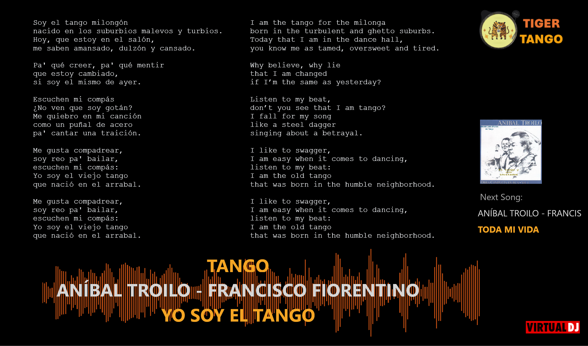
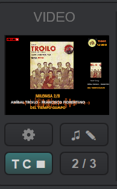
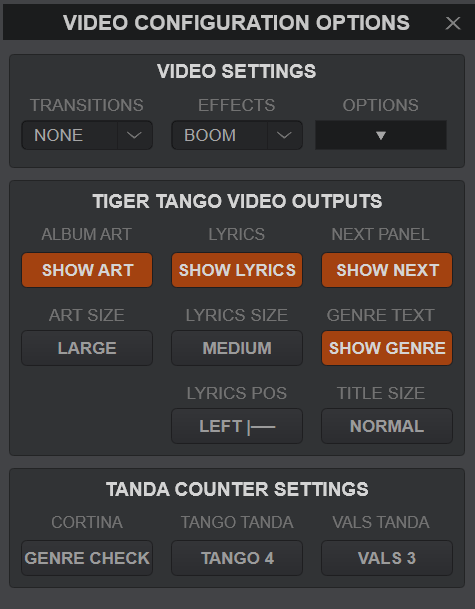

# Video Skin

The TigerTango Video skin allows you to display song information to an external screen or monitor. Information that can be displayed includes:

* Track title and artist
* Genre
* Tanda position
* Upcoming Track
* Album cover art
* Song lyrics (and translations)
* Event logo or image

> [!IMPORTANT]
> For full functionality, download both the TigerTango skin and the TigerTangoVideo Video skin (they are two separate things). The video skin cna be found in Settings -> Interface -> Video Overlay -> TigerTangoVideo.

## Video Area

The Video Area, which is the leftmost panel of the Mater area, is where you configure the video output. 

* Click the video symbol to toggle the display
* Right click to toggle the type of output
* If the video is active, then right click the video display area to toggle between a small and large preview. Large preview can be easier to see what is being displayed.

The Gear icon is configures video options. See the [Opitons](#options) section for details.

The music and pen icon toggles whether to display lyrics. See the [Lyrics](#lyrics) section for more details. If lyrics are displayed then the lyrics button will be lighted. Right clicking the lyrics button allows you to edit the currently playing song. 

The Bottom two buttons configure the tanda counter, which will display the current tanda position in the video skin. The T C (tanda counter) button toggles whether or not the tanda counter is active. When active the button will light up. 

The bottom right button displays the tanda position. The tanda postion should update automatically. You can manually increment by clicking the button. Right clicking will reset the counter to zero. 

## Operating the Tanda Counter
The tanda counter allows you to display the tanda position on screen. Click the **TC** (Tanda Counter) button below the options button to start the counter. The suggested process is to start the counter before the first song in your set. See the above section for setting options.

The tanda counter displays which position in the tanda the current track is in, such as being the 3rd of 4 songs.

The counter will loop to 1 whenever the track number is above the current tanda number. It will also reset when a cortina is detected.

> [!IMPORTANT]
> The tanda counter identifies tanda length by looking at the **Genre** metadata tag. Identified generas are ones which contain the words Tango, Vals, Milonga, Alternative (case does not matter, and can contain other words).

The button to the right of the **TC** button shows the current tanda position. Clicking it will increment the position, Right click to reset to zero. Each time a new song is loaded the counter should increment by 1.

## Options

The Options button opens the video configuration options window. 

> [!NOTE]
> If the TigerTangoVideo video skin is not loaded, then a popup button at the bottom of the configuration menu will apprear.

### Video Settings
The Video settings area allows you to update video effects, transitions, and options. See the virtual DJ documentation for a complete description of these  options.

>[!NOTE]
>You will likely want to make sure that all transitions and effects are turned off in the Video Settings. 

### Tiger Tango Video Outputs
These buttons control elements on the TigerTango video screen.

* **SHOW ART** toggles whether or not to display album art.
* **ART SIZE** toggles between displaying a large or smaller album art on the display.
* **SHOW LYRICS** toggles whether to display lyrics. Lyrics can be saved in the *Comments* metadata section. See the [Lyrics](#lyrics) section for details.
* **LYRICS SIZE** cycles between smaller, medium, and larger lyrics text fonts.
* **LYRICS POS** toggle between left justification and center justification.
* **SHOW NEXT** toggle whether to display a panel of what the next track will be.
* **SHOW GENRE** toggle whether to display the track genre above the artist name.
* **TITLE SIZE** toggle between 'NORMAL' and 'LARGE' title size. The Large size can be useful for reading on smaller screens. 
  
### Tanda Counter Settings
These buttons configure how the tanda counter operates. 

* **GENRE CHECK** By default, a cortina is identified as any song whose genre is not in: Tango, Vals, Milonga, Alternative (case does not matter). If Genre Check is activated, then a cortina will be idenfied only when 'Cortina' is included in the genre name.
* By default, Tango tandas are 4 songs and Vals tandas are 3 songs. These can be updated to 3 (4) songs by toggling the buttons. Milongas and Alternative songs are fixed at 3 songs for the tanda.

## Lyrics
Click the lyrics button to toggle displaying lyrics on or off. Right click to edit the lyrics of the currently loaded song.

You can display lyrics to the screen as follows:
1. Add lyrics to the **Comments** metadata tag (unfortunately the comments tag was the only option to use because it is the only tag that allows multiline inputs).
> [!NOTE]
> You can add lyrics by selecting a song and clicking the 'COMMENTS' section in the info browser area (bottom right area).
> You can also edit the lyrics of a currently loaded song by right clicking on the lyrics button in the video area.
2. Enable **SHOW LYRICS** (either in the options panel, or by clicking the ♫✎ button)
3. Start the video. Lyrics should display after 10 seconds of showing the album art.
4. You can change text size through the options panel.
5. Tracks without lyrics (empty comment tag) will display the album art.

You can also include translations by including them in the comments as well (Any text in the comments tag will display as static text).

> [!WARNING]
> Enabling lyrics will display any comments in your track comments metadatdata area

The amount of lyrics that fit on the screen depend on the lyrics font size and the screen configuration. The following values are a rough estimate, but you may have to test based on your specific screen. 

Size | Characters | Rows
-----|-----|-----|
Small | >150 | 38 |
Medium | 132 | 28 | 
Large | 98 | 22 |
Larger | 85 | 18 | 

The Font type used in TigerTangoVideo is 'Courier New', which is a monspaced font. A monospaced font is useful for aligning columns if you want to display lyrics and translations side by side. 

While there is no automatic way to project both lyrics and translations, you can add translations by including them as a second column. 

> [!NOTE]
> If you are adding both lyrics and translations, it will likely display best if you toggle the left justification in the video options menue so that the lines to keep the columns aligned.

## Adding a Custom Logo. 
Some users may want to add a custom logo, such as their own personal logo or an event logo. This can be done with the following steps: 
1. Open the location of the TigerTangoVideo Skin folder
> [!NOTE]
> You can find the video skin folder by going to Settings -> Interface -> Video Overlay and click "Edit this Skin" in the lower right. On Windows this location will likely be Users\<USERNAME>\AppData\Local\VirtualDJ\VideoSkins\TigerTangoVideo  

2. Make a copy of the Logo.png file to save for later. 
3. Open the Logo.png file in a graphics editor (Photoshop, paint, ect.) 
4. Place your logo in the "Put Your Logo Here" box and save the the Logo.png file. 
This logo should now display to the video skin. 

> [!NOTE] 
> If you want to remove the logo or use a new custom logo, then just replace the Logo.png file with the previously saved copy. 

## Next Section ➡️ [Example Workflow](ExampleWorkflow.md)
